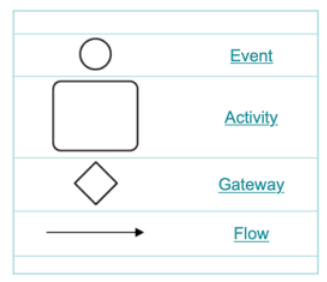
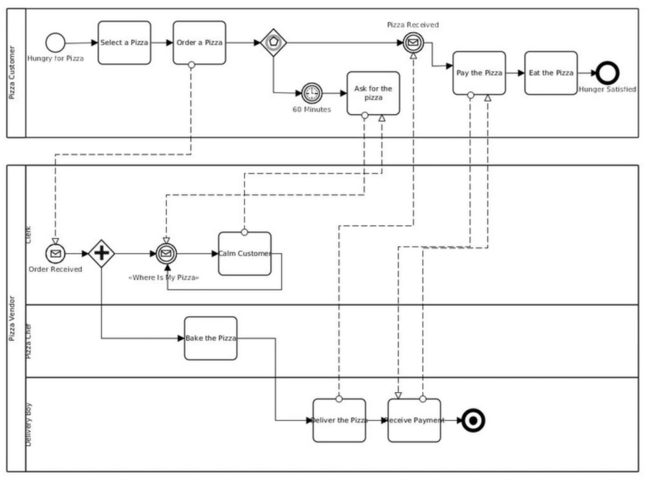
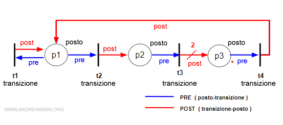
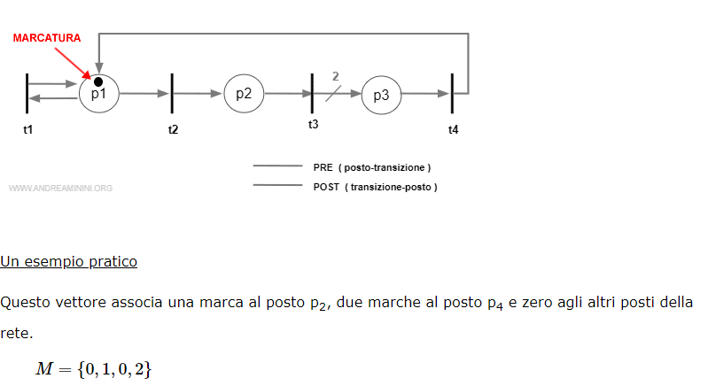
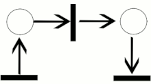

# Process Discovery:

> They refers to techiniques that manually or automatically construct a representation of a business process an ogrs is performing.
>
> **Observed process** vs **Expected process**

It is realized, in *processi mining*, using inductive or selective algorithms that take the Event Log in input and provide a process model in output, that can be *Directly-follow graph/Petri net/Process tree*.

There are Notations for **business Process Model** that has been developed by the Industry, like UML Activity Diagram, BPMN (**THE MOST USED, AS WELL PMTK USE IT!!!**) and EPC (event-driven process chain).

All of these models do not have execution semantics, they **only provide notations**.

## [BPNM](https://www.bpmn.org) - Business Process Model Notation:

Is an OMG standard that allows you to represent Event, Activity, Gateway and Flow with swimlanes, intermediate events, business roles and data objects.

To provide a *formal semantisc to PM* we need a Turing Complete models such as **Petri Nets \\/ Temporal Logic**.

## [Petri Net](https://www.andreaminini.org/sistemi/reti-di-petri/):

A Petri Net of the kind of *transition/place or P/T* is a structure composed by two set and two matrix. $N=\{P,T,Pre,Post\}$.

Is an biparty directed graph with wieghted edge composed by *places and transitions*. $P$ stands for *Places* meanwhile $T$ stands for *Transitions*.

The *Places* are represented by **circles**, while the *Transitions* are represented by **Bars o Rectangles**. $P$ and $T$ are supposed to be disjoint sets.

The edges from $p$ to $t$ are the $Preconditions$, meanwhile from $t$ to $p$ are the $Postconditions$. They are represented by two *transitions matrixes* called $Pre$ and $Post$.

When the two matrixes are joined they form the *matrix of incidens*, but it comports lose of informations.

We can then add a *marker* that indicates the current states of the net $P/T$, this marker is a function that associate each places to a natural number (not negative). The markers are indicated by a vector $M$ with elements even to the places of the net.

This is a common example of a simple Petri Net.z