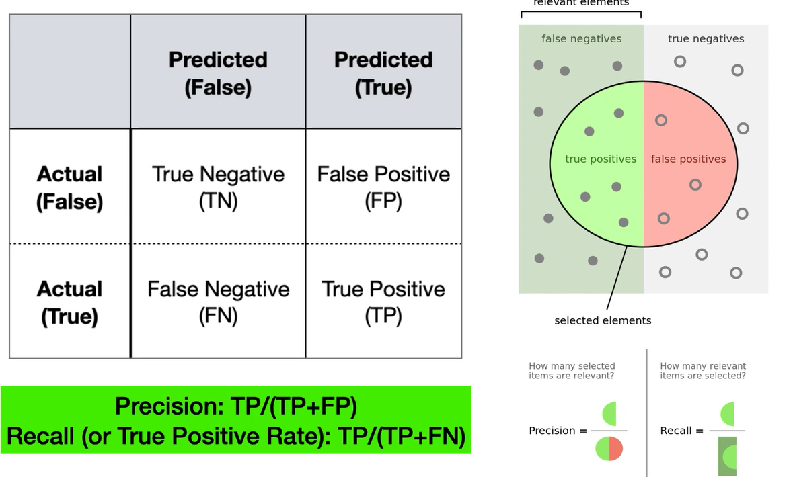

# Petri Net recall:

We are able to represent formally the behaviour of Business Process. We can represent a sequence of events, a conflict when we have alternative events starting from a common one. We can describe parallel execution without an ordering because any order is possible.

For Business Process we use a special type of Petri Net, where we always have a point of start and a point of end, so we are gonna use a special subset of Petri Net, like this one:

# Directly-Follo graph - DFG:

A directed graph with vertices V denoting the activities of a process, while the edges E model the target activity as it can be executed immediatly after the source activity finish.

It can be extended by marking some vertices and a path from a start to a completion vertex represents a possible execution sequence of the process.

# Process tree:

# Workflow net - WF-net:

A subset of Petri Net with:

- One *input place (start)* and one *output place (end)*
- It has to satisfy:
  - Option to complete, *It is always possinle to reach a transition that marks plkace end*
  - Proper completion, *if an end is marked all other places should be empty*
  - No dead transition, *it should be possinle to excecute transitions by following the appropriate rout throught the wf-net*

# Process discovery techniques:

The most active research topic in process mining, but not in the industry.

## The $\alpha$ algorithm:

The first alg proposed in PM. Given a trace you *infer dependency relations based on the directly follow relations obeserved between two succeding activities*.

****

## Heuristic Miner - HM:

Introduces the filtering of infrequent behaviour based on the observation of relation between activities and a definition of a range or something like that.

## Inductive Miner - IM:

Uses a divide and conquer perspective, recursively splitting the event log int sub-logs.

It built a *DFG* then i split the log into sub logs. The cutting procedure (exclusive choice cut, sequence cut, parallel cut, redoloop cut) is repeated until a sublog with only one activity is reached. The sequence of operators and activities can then be represented as a process tree, easily convertible to other process modelling notations

It is **also able to identify hidden activities etc...**

## Generic Miner:

Applies the basic principle of the evolutionary algorithms. Given an initial solution and a goal, the alg evolves this solution for *optimising the goal*.

> **genotype**: causal matrices containing the input and output activities of each transition

> **goal**: fitness function

> **evolution**: mutation and crossover

## Validating predictive models:

The same old soup. There are **multiple quality metrics that must be balanced**

- Recall, aka fitness, the discovered model should allow for the behavior seen in the event log (**avoiding non fitting behaviour**). *The most important one*
- Precision, the discovered model should not allow for behavior completely unrelated to what was seen in the event log (**avoiding underfitting**)
- Generalization, the discovered model should generalize the example behavior seen in the event log (**avoiding overfitting**)
- Simplicity, the discovered model should not be unnecessarily complex (**common use case: Human Readability**)

### Fitness and Precision:

Can be intuitively defined as the assesment of the extend of the intersection of the behavior of a Model $M$ and an Event Log $L$.

Fitness avoid non fitting behavior, so it divides for the Event Log se, meanwhile Precision avoid underfitting, so it divides for the Model.

#### Recall/Fitness:

Token-based replay technique that, along with a list of transitions enabled during the replay, produces the number of consumed tokens, produced tokens, missing tokens and remaining tokens.

#### Precision:

Derived from the quantification of escaping edges and their frequencies. **The more the model differs from the log, the less precise it is.**

Assume $L$ as the log, $M$ as the PetriNet model, $E_E$ as model escaping edges, $A_T$ as model allowed tasks, $\sigma$ as....

[look to the slides for completing this and **generalization and semplicity**]

#### Reminder:

*Always remember to balance this! It doesn't matter if Precision is high if Fitness is low.....*

## Featuring discovery algorithms:

For example in *pm4py* we have some algorithms that realized what talked over this paragraph. Each algorithm have a special set of characteristic and should be used with manner.

