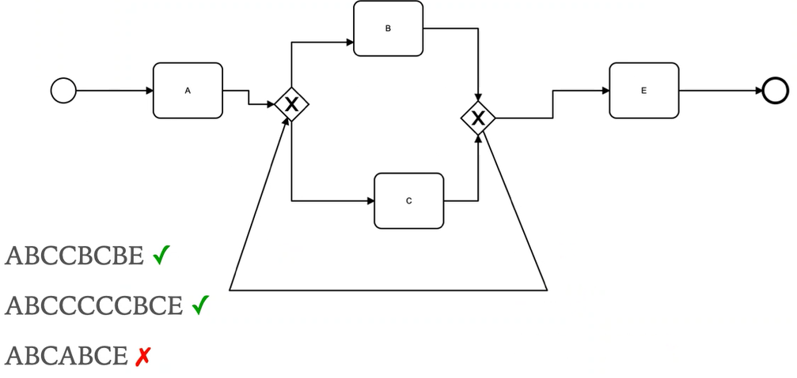
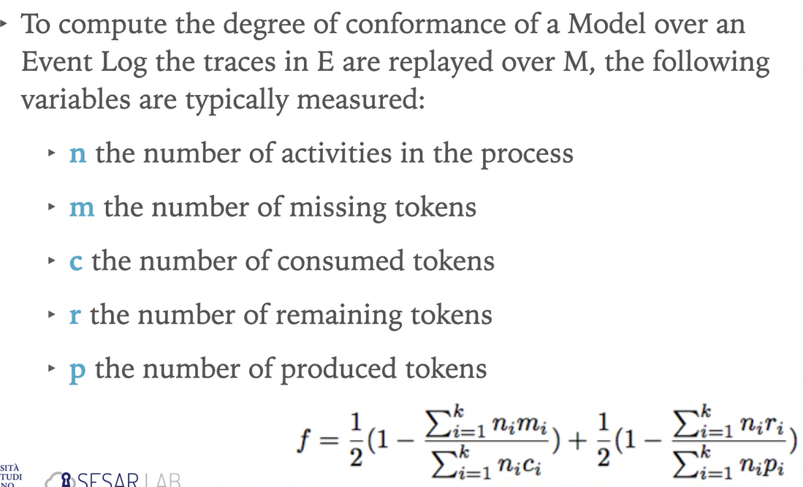
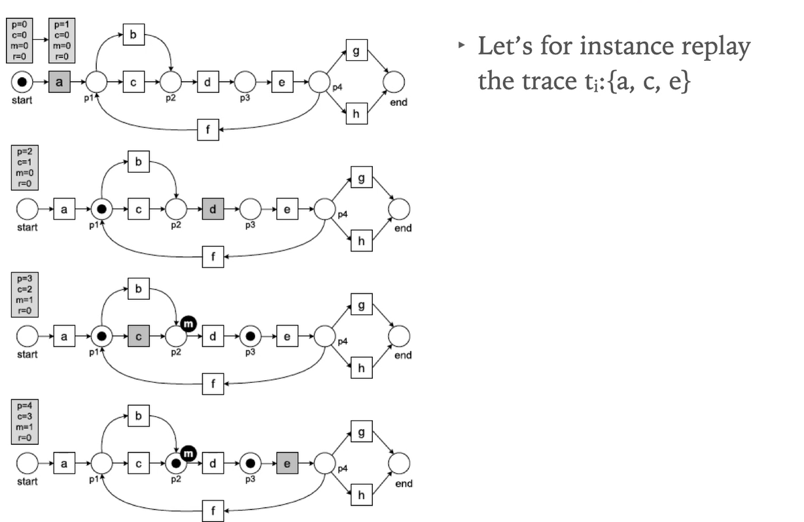

# Conformance Checking:

Aims to identify and measure of the deviations between the actual execution of a business proess, as recorder in the event log, and a set of prescriptive specifications.

We have a match between **Observed Process VERSUS Expected Process**. As well we can do Conformance Checking with a *Model-Based* or with *Rule-Based*.

## Rule-Based:

Identifies constraints the execute behavior has to comply with. There are a lot of rule to apply on this method and it is also associated with Business Rules to constraint the operations that apply to an organization.

Talking about Conformance Checking Rule-Based binded with Business Rules we can also explore a lot of different subsets of rules that have a graphical expression and can be represented in a graph or in a diagram!

## Model-Based:

The events that are involved in iterations and concurrent executions bring a process model to generate infinite behavior.

## CC Techniques:

**Techniques for detecting deviations in the log behavior.**

### Replay

Each trace is replayed against the process model one event at a time, the errors are used to detect the deviations.

### Trace alignment

For each trace in the log they identify the closes trace that can be parsed by the model.

### Behavioral alignment

A negative event is inserted after a given prefix of a trace if this event is never observed preceded by that prefix anywhere in the log, if the process model can replay the negative events, it means that there is behavior captured in the process model that is not captured in the log.

## Purpose of CC:

It may serve multiple purposes:

- Identify **deviating behavior** in the Event Log (**dysfunctional behavior**)
- Identify **additional behavior** to update the model (**unspecified behavior**)

The combination of these two purposes is typical, remove the trivial error and learn new behavior to be specified. CC can also be exploited to compare two segments and verify if their behavior differ (number of deviations differ)

# Replay techniques:

Useful if we have a Petri Net... 

