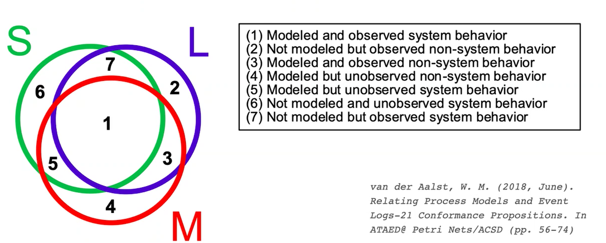

# Conformance Checking:

Aims to identify and measure of the deviations between the actual execution of a business proess, as recorder in the event log, and a set of prescriptive specifications.

We have a match between **Observed Process VERSUS Expected Process**. As well we can do Conformance Checking with a *Model-Based* or with *Rule-Based*.

## Rule-Based:

Identifies constraints the execute behavior has to comply with. There are a lot of rule to apply on this method and it is also associated with Business Rules to constraint the operations that apply to an organization.

Talking about Conformance Checking Rule-Based binded with Business Rules we can also explore a lot of different subsets of rules that have a graphical expression and can be represented in a graph or in a diagram!

## Model-Based:

The events that are involved in iterations and concurrent executions bring a process model to generate infinite behavior.

## CC Techniques:

**Techniques for detecting deviations in the log behavior.**

### Replay

Each trace is replayed against the process model one event at a time, the errors are used to detect the deviations.

### Trace alignment

For each trace in the log they identify the closes trace that can be parsed by the model.

### Behavioral alignment

A negative event is inserted after a given prefix of a trace if this event is never observed preceded by that prefix anywhere in the log, if the process model can replay the negative events, it means that there is behavior captured in the process model that is not captured in the log.

## Purpose of CC:

It may serve multiple purposes:

- Identify **deviating behavior** in the Event Log (**dysfunctional behavior**)
- Identify **additional behavior** to update the model (**unspecified behavior**)

The combination of these two purposes is typical, remove the trivial error and learn new behavior to be specified. CC can also be exploited to compare two segments and verify if their behavior differ (number of deviations differ)

# Replay techniques:

Useful if we have a Petri Net... 

> [Token-based replay](https://en.wikipedia.org/wiki/Token-based_replay)
>
> **Token-based replay** technique is a [conformance checking](https://en.wikipedia.org/wiki/Conformance_checking) algorithm [[1\]](https://en.wikipedia.org/wiki/Token-based_replay#cite_note-1) that checks how well a process conforms with its model by replaying each trace on the model (in [Petri net notation](https://en.wikipedia.org/wiki/Petri_net) ).[[2\]](https://en.wikipedia.org/wiki/Token-based_replay#cite_note-:0-2) Using the four counters *produced tokens, consumed tokens, missing tokens, and remaining tokens,* it records the situations where a transition is forced to fire and the remaining tokens after the replay ends. Based on the count at each counter, we can compute the *fitness value* between the trace and the model.

# Trace alignment:

Another approach to execute CC. We organize our events in a matrix, including the missing activities...

The alignement between a pair of traces T1 and T2 can be considered as a transformation of T1 to T2 or viceversa through a set of editing operations. 

Usually we *prefere the one that minimise the mismatches*. We name *log moves* the mismatches obtained ny introducting a skip symbol (-) in the log and *model moves* the mismatches obtained ny introducting a skip symbol in the model (-).

The algorithm is originated by bioinformatics, where it is used to align protein and gene sequences to identify common structures and mutations.

[see slides...]

We classify traces in our matrix in four classes:

- **Early**, activities execute before than specified in the model
- **Late**, activities execute later than specified in the model
- **Insert**, acitivities executed in the log but not in the model
- **Skip**, activities specified in the model but not executed in the trace

# Process mining Epistemic Dilemma:

Process discovery and CC are not predictive models. We use these techniques to measure the appropriateness between two artifacts.

**The event log contains example behavior**, we cannot know if it covers all of the behavior the model should represent

**The model i a representation**, we cannot know if it is represent all the behavior the system made possible.

If fitness is low we consider it **disfunctional!** If it isn't low we can consider it valid and proceed.

