# Unofficial summary of BIS 2023/2024:

# Designing Information System:

An **Information System** is a **Scientific Discipline** with:

- A **SCOPE**, it investigate, categorize and evaluate methods for developing IS in organizations
- An **HISTORY**, it has been originated in business schools then it spread has been spreaded in other communities (such CS)
- A **SCIENTIFIC COMMUNITY**, with many international conferences (*ICIS, ECIS, BPM, ICMP), journals and so on
- An **INDUSTRIAL COMMUNITY**, with methodologies and tools (ERP systems, BPM systems, PLM systems, HRM systems)

**Process Mining** is a **Research Field** with:

- A **SCOPE**, it supports the analysis of operational processes based on event logs
- A **HISTORY**, it was originated in a CS department as an approach to interconnect Data Science and Business Proces Management
- A **SCIENTIFIC COMMUNITY**
- An **INDUSTIRAL COMUNNITY**

The **Goals** of an **IS** are developing and exploiting methodologies to align IT designing choices with business objectives, here is a small summary of these methodologies/sciences:

- **Design Science**. It is focused on the development of  artifacts with the explicit intention of improving their functional performances. It is considered as a *constructive science* and it can be viewed as the *process of mapping a goal space to an attribute space, where an artifact satisfying the mapping constitutes a point in that aligned space*.
  **It ISN'T an Explanatory Science**, because if the observations show an artefact doesn't meet the requirements you can change the artefact or the requirements
  ****
  On the left we have the Explanatory Science (ES) while on the right we have Design Science (DS)
- **Management Science**. It studies methods and tools to support problem solving and decision making in orgs. It is also an interdisciplinary study with links to Management, Economics and so on.
- **Information Management**. It concerns the *definition and the administration of the information lifecycle* in orgs. So it starts from the infos acquisition (from one or more sources), the storage, distribution and the ultimate dispositions (aggregation, archiving or deleting).
- **IT trends**. We have to observe the market to get the operating conditions of the design paradigms, knowing the history, testing techs and study strategical interaction to understand decision making models in evolving systems
- **CS methods**

## Core notions of IS:

We have to use the *scientific method* in designing IS in support of business and orgs activities, so we should **Observe, Design, Measure and Evaluate** (ODME). 

In the design phase we should be aware that in Design Science we can change the Artefact or the Requirements if the observation doesn't meet the requirements!

The **data generated by IS** must be used to validate design or to modify them (Process Mining).

For IS the development life cycle (DLC) may potentially include hundreds of activities with their own methodologies an tools, but the USA Department of Justice has identified for use 10 steps and 42 methodologies to be adopted in a project.,

We also have the life cycle for BPM, that supports orgs for planning and standardizing their activities. It is an iterative set of activities splitted in 6 phases:

There are three essential keywords in IS:

- **GOALS**, the final purpose. 

  - Such as *Key Performance Indicators* that synthetize raw data into business metric used to measure the activities of an individual/department/etc.

- **SPECIFICATIONS**, prescriptive knowledge that allows orgs to reach goals and improve performance.

  - *Modelling Business Rules*
  - *Modelling the Business Process*
  - *Modelling the Data Flow*

- **OBSERVATIONS**, observation of the reality that must be aligned with specs and goals.

  - There are a lot of different techniques for Observations (also KPI/Event logs) are used:

    

Any Observation that describe information processing must be consistent with Specification and Goals.
The possible dependencies and conflicts between Goals must be concisely handled.
Specifications are *prescriptive knowledge* that allow orgs to reach Goals and improve performances.

The *Knowledge* can be divided into:

- **Descriptive** knowledge
- **Prescriptive** knowledge
- **Predictive** knowledge

And it is also divided into:

| Data must be prepared to become Information Information must be integrated, aggregated and filtered to become Knowledge Knowledge is the final stage of descriptive data analytics Wisdom is what we learn from the knowledge and what we observe from predictive analytics |  |
| ---- | ------------------------------------------------------------ |

## Continental Airlines Case Study:

The company had a problem with 6% of the customers, regarding the customer care department, so it has realized that the data must had the answer for this problem.

CA has analyzed the calls that it has received to get information and then it has obtained Knowledge and Wisdom with being finally acknowledge that 14% of customers calls were for reconfirming flights.

So the company ran a notice in its in-flight magazine to assure fliers that such calls were unnecessary, within a year there was 20% fewer calls and the customers satisfaction rose by ~10%.

# Designing Specifications:

During the design of an IS, **specifications** are essential to document the development life cycle because they allow to *identify, describe, prescribe and verify* what we want to implement, also providing an input to predictive models to shape the observed trends.

The **Specifications** include:

- **Goals**
  - Capturing goals let you focus on relevant activities, understanding the interconnections, exploring alternatives, assessing performances and so on.
  - **KPIs** permit to synthesize raw data making them clear to observe, this permit us to choose our goals based on performance indicators.
    - A **performance indicator** implies measuring one or more measurable dimensions and his values are often referred as **levels**. In the end an indicator may be connected to an objective stating the level to be achieved or the improvement of the level we expect
    - 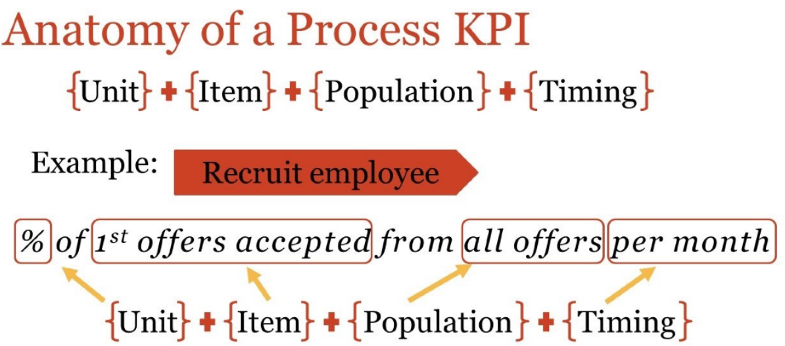
    - It involves three steps: *Determine the Key Strategic Objectives* -> *Define Success* -> *Decide on measurement (unit, temporal frame, data source)*
  - **Balance Scorecard** is a popular methodology to identify the organizational goals, define the KPI and monitor them
    - 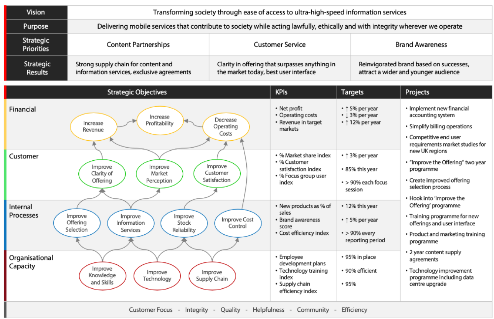
- **Business** **Rules** constraint the operations that apply to an orgs. They are designed to help an orgs achieving aits goals and to provide *efficiency, consistency and predictability*.
  - **Define a vocabulary** of terms adopted by the orgs
  - **Describe facts** that may be observed in the orgs
    - According on the Business Rules Group BRs
  - **Constraint the behaviour** of the orgs
    - According on the Business Rules Group BRs
  - **Explain how knowledge can be derived or transformed**
    - According on the Business Rules Group BRs
  - They can be documented as natural language sentences, controlled languages or structures in a graphical model!
  - There is a standard that is **Semantics of Business Vocabulary and Business Rules** from OMG. It is a *controlled language* (a subset of standard English with restricted syntax and semantic described by a small set of construction and interpretation rules). 
    - Unfortunately a controlled language, if it is not appropriately designed, can easily became intractable
    - The subsets can be mapped to First Order Logic or other formal languages in the family of Temporal Logic and Modal Logic
  - They can be **alethic** or **deontic**
    - **Alethic** indicates how the world is. If violated it indicates a dysfunction or impairment
    - **Deontic** indicates how the world ought to be. If violated it indicates a missed goal or an unachieved performance.
- **Business** **Process** **Models**, series of techniques supporting description, prescription and explanation of the process of activities. These methods can range from different degrees of formality and they focus to find the activities to achieve the goals!
  - **Business process Modelling Notation - BPMN** is an OMG standard that involves *Events, Activities, Gateways and Connections:* 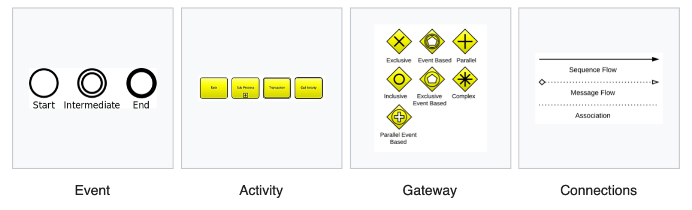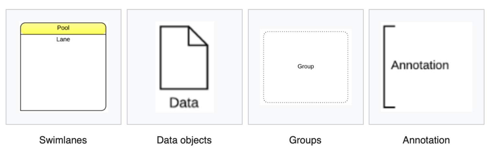
  - 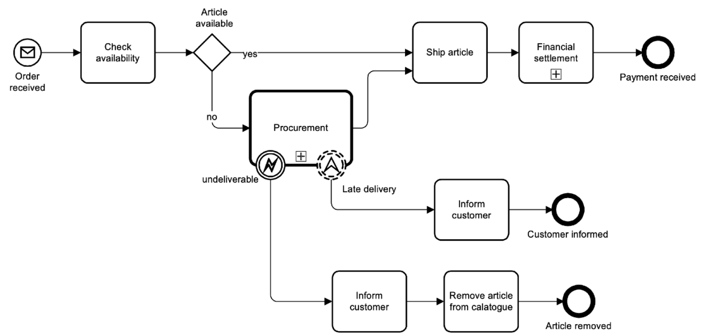
  - 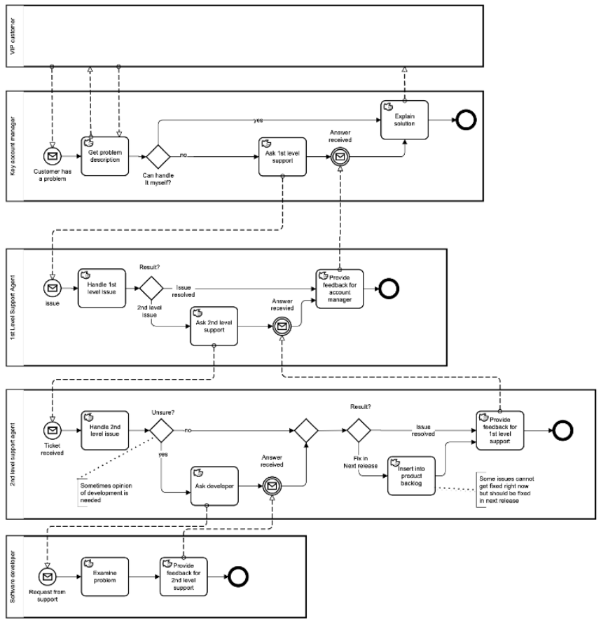
- **Data** **Flow** **Models** are the intersection between Process Management and Infrastructure Models (used to design software components and systems)
  - 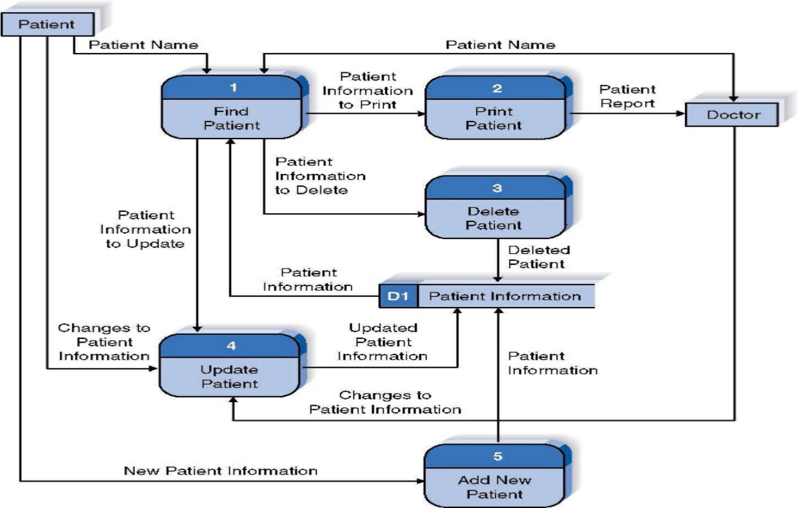
  - 
  - They are composed, usually, by 4 main elements, that are *Process, Data Flow, Data Store and External Entity*
  - It is said **Decomposition**, a process of modelling the system and its components in increasing levels of detail. Balancing involves ensuring that presented infos at one level of a DataFlowDiagram are accurately represented in the next level of DFD.
    - *Context Diagram*, that shows the context into which the business process fits, the overall business process as just one process and all the outside entities that receive information from or contribute information to the system
    - *Level 0 Diagram*, shows all the processes that comprise the overall system, how the infos moves from and to each process and add data store 
    - *Level 1 Diagram*, shows all the processes that comprise a single process on the level 0, shows how infos moves from an to each of these processes and it has more detail of higher level processes [may not be needed]
    - *Level 2 Diagram*, show all processes that comprise a single one in level 1, shows how infos move from and to each of these processes [may be not needed]
- And so on, like reports, questionnaire, event logs, vocabularies, directives, ontologies, requirements, regulations, etc.

To be effective the must be *compared to observations* in order to verify our achievements and acquire new knowledge.

Specification are mainly expressed in:

- **Descriptive Knowledge**
- **Prescriptive Knowledge** supporting Conformance Analysis (problem can be described by Facts, Extended Knowledge -> Constraints) or Performance Prediction (problem can be described by some functions)

## E3Value:

It was designed to help define how economic value is created and exchanged within a network of actors. So it extends the common tool used in CS to match the uncertainness of the business world (what a shame for us).

It permits to Modelling Value, like if we are eliciting a constellation. Who are the actors involved (entrerpises and final customers), what do they transfer in terms of economic value and what do they request in return, why do they transfer these values (bullshit usually) and what activities do they perform to produce or consume that value?

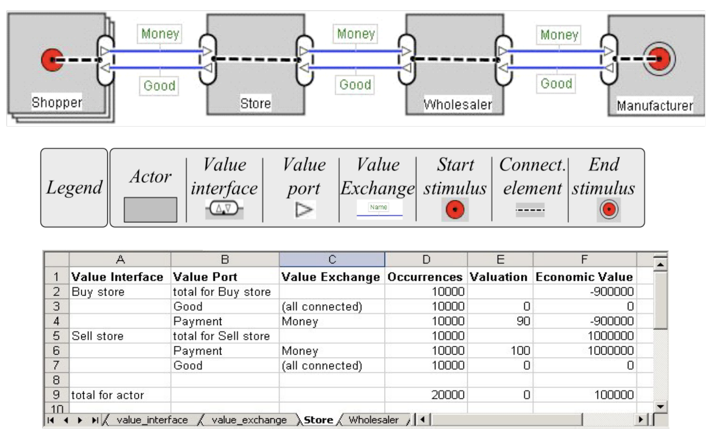

 It use some graphic stuff to represent things involved:

- **Actor**, it models an economically independent entity ****
- **Value Object**, it models a service, a good, money or even an experience which is of economic value for at least one of the actors in a value model. We model only things of economic value (that can be observed)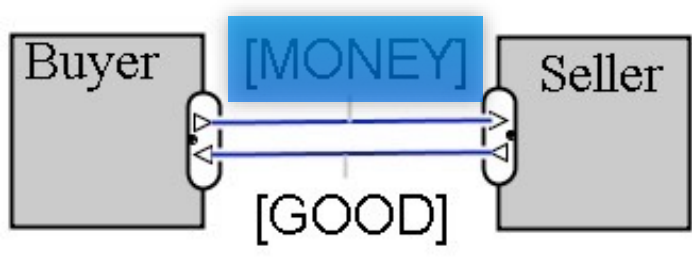
- **Value Port**, it models provisioning or requesting value objects to or from actor's environment, so a change of ownership or rights. It is used to abstract away from internal business processes the request from the offer. 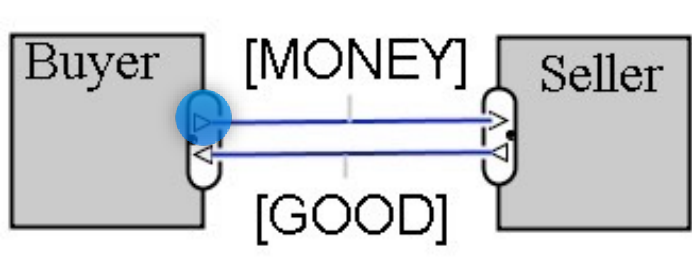
- **Value Interface**, groups of in/out-going value offerings that models economic reciprocity. [*music + payment + online access + payment*]. 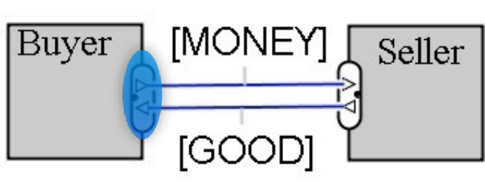
- **Value Offering**, groups equally directed ports or mixed bundling of value in combination. [*music + online access*]. 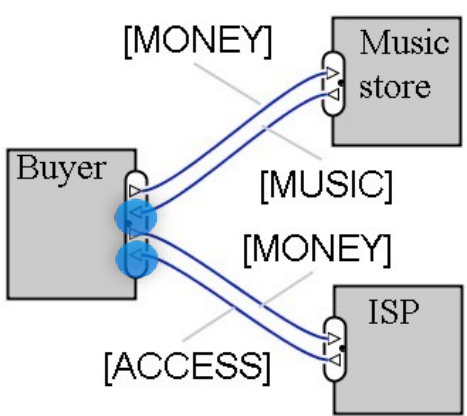
- **Value Transfer**, it connects two value ports with each other modelling one or more potential trades of value objects, showing which actors are willing to transfer value objects with each other. 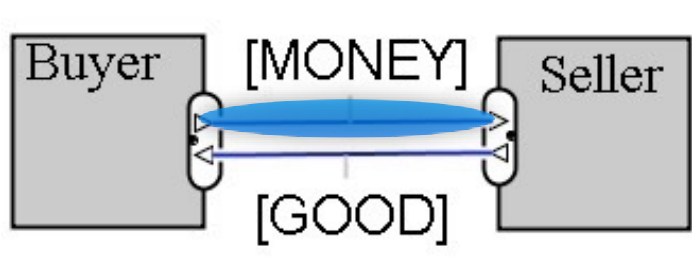
- **Market Segment**, it simply breaks a market into smallest segments with common properties modelling that a number of actors assign economic value to objects in the same way.
- **Composed Actor**, it models that actors offer something of economic value as a *partnership*. 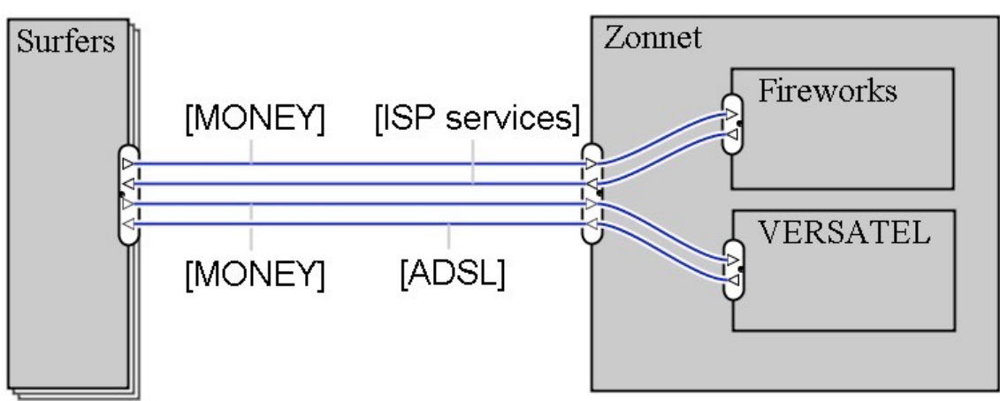

In the end is important to compare multiple versions of a model to verify the impact of specific design choices. We have to think about *what is currently as **AS-IS** version* while *what is proposed as **TO-BE** version*.

## Pharmaceutics Data case Study:

EA is a company that publish infos about drugs and medical devices collected every 4 months in an handbook to be sold to physicians and medical practitioners. Now EA is changing the model introducing the possibility, for the customer, to pay an annual fee and receive updates each time infos on a single item is available. So EA is delivering infos on internet for the registered users.

EA is also lowering fees to a specific portions of knowledge, while collecting statistical infos on the users queries for improving the knowledge base.

- **AS IS Goals:** (how it is now)
  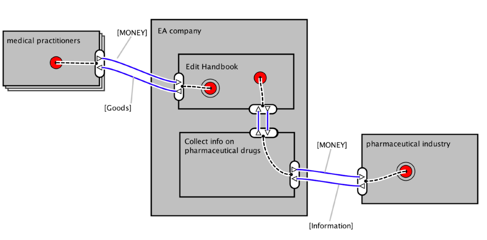
- **TO BE Goals:** (how it ought to be in the future)
  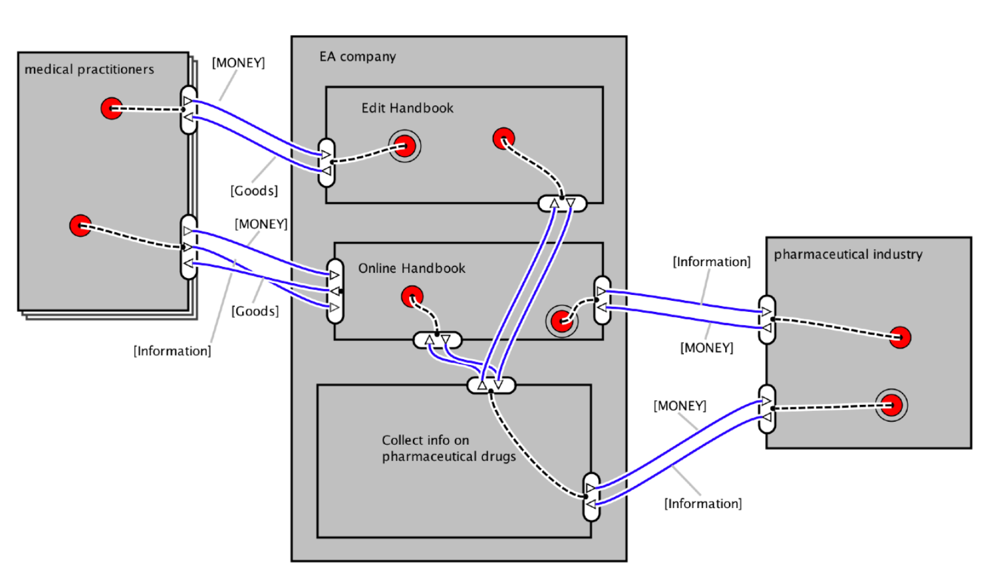

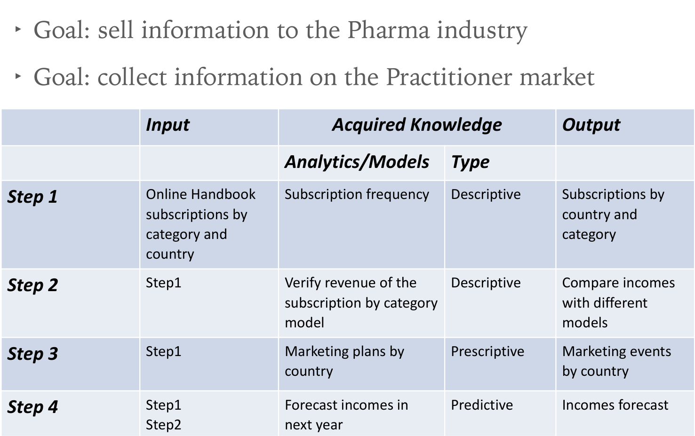

So the goals are sell infos to the Pharma Industry (so selling the new portions of Knowledge Base) and collect infos on the Practitioner market (so collecting stats to improve the Knowledge Base)

# Performance Measurement:

It is one of the most impacting management activities on *knowledge acquisition*.

**Performance measurement** is the process of reporting on the performance of an organization and among the most common methodologies to address this activity we consider:

- **Balance Scorecard**, a framework for measuring orgs performance using a balanced set of performance measures
- **Key Performance Indicator**, a method for choosing significant performance measures based on the business functional area to monitor

According to **ICMP (Institute of Certified Professional Managers)** there are 5 functions that are essential for Management:

- **Planning**, choose appropriate goals and actions to pursue the goals
- **Organizing**, implementing the actions to achieve orgs goal at *operational and tactical levels*
- **Leading**, it involves training, insipiring and motivating people using an effective communication and "vision"
- **Staffing**, recruiting employees for positions within the company
- **Controlling**, evaluate how well you are achieving your goals

**PM** is part of the *control function that is orhogonal to all the other functions*, while impacting evaluation and decision making at different levels (of controls):

- **Strategic**, monitor the goals and the high-level functions to be performed
- **Operational**, monitor the procedures that implement the functions
- **Tactical**, monitoring the task that compose the procedures, configure them and take-real time decisions

Control can be applied simply by transferring habits, values and beliefs to people within the orgs and if control has to be **objective**, KPI or measures are required together with Observations!

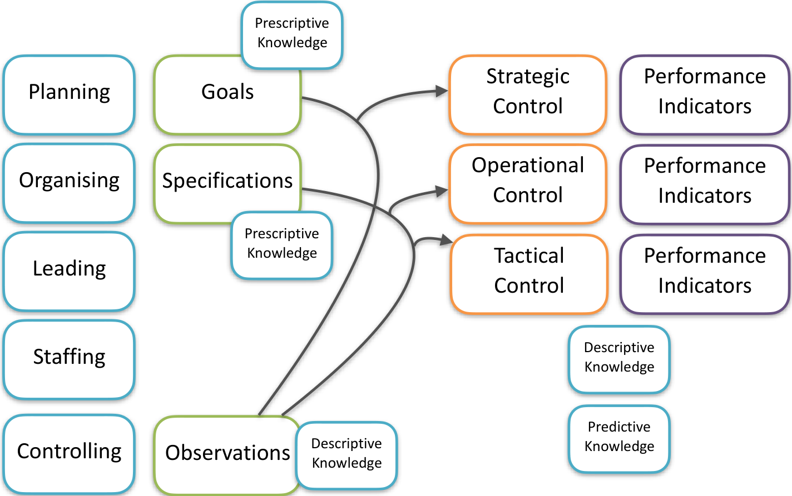
