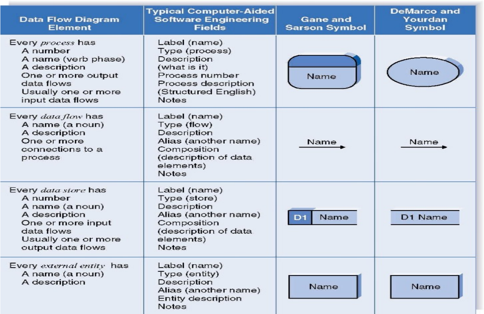

# Unofficial summary of BIS 2023/2024:

# Designing Information System:

An **Information System** is a **Scientific Discipline** with:

- A **SCOPE**, it investigate, categorize and evaluate methods for developing IS in organizations
- An **HISTORY**, it has been originated in business schools then it spread has been spreaded in other communities (such CS)
- A **SCIENTIFIC COMMUNITY**, with many international conferences (*ICIS, ECIS, BPM, ICMP), journals and so on
- An **INDUSTRIAL COMMUNITY**, with methodologies and tools (ERP systems, BPM systems, PLM systems, HRM systems)

**Process Mining** is a **Research Field** with:

- A **SCOPE**, it supports the analysis of operational processes based on event logs
- A **HISTORY**, it was originated in a CS department as an approach to interconnect Data Science and Business Proces Management
- A **SCIENTIFIC COMMUNITY**
- An **INDUSTIRAL COMUNNITY**

The **Goals** of an **IS** are developing and exploiting methodologies to align IT designing choices with business objectives, here is a small summary of these methodologies/sciences:

- **Design Science**. It is focused on the development of  artifacts with the explicit intention of improving their functional performances. It is considered as a *constructive science* and it can be viewed as the *process of mapping a goal space to an attribute space, where an artifact satisfying the mapping constitutes a point in that aligned space*.
  **It ISN'T an Explanatory Science**, because if the observations show an artefact doesn't meet the requirements you can change the artefact or the requirements
  ****
  On the left we have the Explanatory Science (ES) while on the right we have Design Science (DS)
- **Management Science**. It studies methods and tools to support problem solving and decision making in orgs. It is also an interdisciplinary study with links to Management, Economics and so on.
- **Information Management**. It concerns the *definition and the administration of the information lifecycle* in orgs. So it starts from the infos acquisition (from one or more sources), the storage, distribution and the ultimate dispositions (aggregation, archiving or deleting).
- **IT trends**. We have to observe the market to get the operating conditions of the design paradigms, knowing the history, testing techs and study strategical interaction to understand decision making models in evolving systems
- **CS methods**

## Core notions of IS:

We have to use the *scientific method* in designing IS in support of business and orgs activities, so we should **Observe, Design, Measure and Evaluate** (ODME). 

In the design phase we should be aware that in Design Science we can change the Artefact or the Requirements if the observation doesn't meet the requirements!

The **data generated by IS** must be used to validate design or to modify them (Process Mining).

For IS the development life cycle (DLC) may potentially include hundreds of activities with their own methodologies an tools, but the USA Department of Justice has identified for use 10 steps and 42 methodologies to be adopted in a project.,

We also have the life cycle for BPM, that supports orgs for planning and standardizing their activities. It is an iterative set of activities splitted in 6 phases:

There are three essential keywords in IS:

- **GOALS**, the final purpose. 

  - Such as *Key Performance Indicators* that synthetize raw data into business metric used to measure the activities of an individual/department/etc.

- **SPECIFICATIONS**, prescriptive knowledge that allows orgs to reach goals and improve performance.

  - *Modelling Business Rules*
  - *Modelling the Business Process*
  - *Modelling the Data Flow*

- **OBSERVATIONS**, observation of the reality that must be aligned with specs and goals.

  - There are a lot of different techniques for Observations (also KPI/Event logs) are used:

    

Any Observation that describe information processing must be consistent with Specification and Goals.
The possible dependencies and conflicts between Goals must be concisely handled.
Specifications are *prescriptive knowledge* that allow orgs to reach Goals and improve performances.

The *Knowledge* can be divided into:

- **Descriptive** knowledge
- **Prescriptive** knowledge
- **Predictive** knowledge

And it is also divided into:

| Data must be prepared to become Information Information must be integrated, aggregated and filtered to become Knowledge Knowledge is the final stage of descriptive data analytics Wisdom is what we learn from the knowledge and what we observe from predictive analytics |  |
| ---- | ------------------------------------------------------------ |

## Continental Airlines Case Study:

The company had a problem with 6% of the customers, regarding the customer care department, so it has realized that the data must had the answer for this problem.

CA has analyzed the calls that it has received to get information and then it has obtained Knowledge and Wisdom with being finally acknowledge that 14% of customers calls were for reconfirming flights.

So the company ran a notice in its in-flight magazine to assure fliers that such calls were unnecessary, within a year there was 20% fewer calls and the customers satisfaction rose by ~10%.

# Designing Specifications:

During the design of an IS, **specifications** are essential to document the development life cycle because they allow to *identify, describe, prescribe and verify* what we want to implement, also providing an input to predictive models to shape the observed trends.

The **Specifications** include:

- **Goals**
  - Capturing goals let you focus on relevant activities, understanding the interconnections, exploring alternatives, assessing performances and so on.
  - **KPIs** permit to synthesize raw data making them clear to observe, this permit us to choose our goals based on performance indicators.
    - A **performance indicator** implies measuring one or more measurable dimensions and his values are often referred as **levels**. In the end an indicator may be connected to an objective stating the level to be achieved or the improvement of the level we expect
    - 
    - It involves three steps: *Determine the Key Strategic Objectives* -> *Define Success* -> *Decide on measurement (unit, temporal frame, data source)*
  - **Balance Scorecard** is a popular methodology to identify the organizational goals, define the KPI and monitor them
    - 
- **Business** **Rules** constraint the operations that apply to an orgs. They are designed to help an orgs achieving aits goals and to provide *efficiency, consistency and predictability*.
  - **Define a vocabulary** of terms adopted by the orgs
  - **Describe facts** that may be observed in the orgs
    - According on the Business Rules Group BRs
  - **Constraint the behaviour** of the orgs
    - According on the Business Rules Group BRs
  - **Explain how knowledge can be derived or transformed**
    - According on the Business Rules Group BRs
  - They can be documented as natural language sentences, controlled languages or structures in a graphical model!
  - There is a standard that is **Semantics of Business Vocabulary and Business Rules** from OMG. It is a *controlled language* (a subset of standard English with restricted syntax and semantic described by a small set of construction and interpretation rules). 
    - Unfortunately a controlled language, if it is not appropriately designed, can easily became intractable
    - The subsets can be mapped to First Order Logic or other formal languages in the family of Temporal Logic and Modal Logic
  - They can be **alethic** or **deontic**
    - **Alethic** indicates how the world is. If violated it indicates a dysfunction or impairment
    - **Deontic** indicates how the world ought to be. If violated it indicates a missed goal or an unachieved performance.
- **Business** **Process** **Models**, series of techniques supporting description, prescription and explanation of the process of activities. These methods can range from different degrees of formality and they focus to find the activities to achieve the goals!
  - **Business process Modelling Notation - BPMN** is an OMG standard that involves *Events, Activities, Gateways and Connections:* 
  - 
  - 
- **Data** **Flow** **Models** are the intersection between Process Management and Infrastructure Models (used to design software components and systems)
  - 
  - 
  - They are composed, usually, by 4 main elements, that are *Process, Data Flow, Data Store and External Entity*
  - It is said **Decomposition**, a process of modelling the system and its components in increasing levels of detail. Balancing involves ensuring that presented infos at one level of a DataFlowDiagram are accurately represented in the next level of DFD.
    - *Context Diagram*, that shows the context into which the business process fits, the overall business process as just one process and all the outside entities that receive information from or contribute information to the system
    - *Level 0 Diagram*, shows all the processes that comprise the overall system, how the infos moves from and to each process and add data store 
    - *Level 1 Diagram*, shows all the processes that comprise a single process on the level 0, shows how infos moves from an to each of these processes and it has more detail of higher level processes [may not be needed]
    - *Level 2 Diagram*, show all processes that comprise a single one in level 1, shows how infos move from and to each of these processes [may be not needed]
- And so on, like reports, questionnaire, event logs, vocabularies, directives, ontologies, requirements, regulations, etc.

To be effective the must be *compared to observations* in order to verify our achievements and acquire new knowledge.

Specification are mainly expressed in:

- **Descriptive Knowledge**
- **Prescriptive Knowledge** supporting Conformance Analysis (problem can be described by Facts, Extended Knowledge -> Constraints) or Performance Prediction (problem can be described by some functions)

## E3Value:

It was designed to help define how economic value is created and exchanged within a network of actors. So it extends the common tool used in CS to match the uncertainness of the business world (what a shame for us).

It permits to Modelling Value, like if we are eliciting a constellation. Who are the actors involved (entrerpises and final customers), what do they transfer in terms of economic value and what do they request in return, why do they transfer these values (bullshit usually) and what activities do they perform to produce or consume that value?

 It use some graphic stuff to represent things involved:

- **Actor**, it models an economically independent entity ****
- **Value Object**, it models a service, a good, money or even an experience which is of economic value for at least one of the actors in a value model. We model only things of economic value (that can be observed)
- **Value Port**, it models provisioning or requesting value objects to or from actor's environment, so a change of ownership or rights. It is used to abstract away from internal business processes the request from the offer. 
- **Value Interface**, groups of in/out-going value offerings that models economic reciprocity. [*music + payment + online access + payment*]. 
- **Value Offering**, groups equally directed ports or mixed bundling of value in combination. [*music + online access*]. 
- **Value Transfer**, it connects two value ports with each other modelling one or more potential trades of value objects, showing which actors are willing to transfer value objects with each other. 
- **Market Segment**, it simply breaks a market into smallest segments with common properties modelling that a number of actors assign economic value to objects in the same way.
- **Composed Actor**, it models that actors offer something of economic value as a *partnership*. 

In the end is important to compare multiple versions of a model to verify the impact of specific design choices. We have to think about *what is currently as **AS-IS** version* while *what is proposed as **TO-BE** version*.

## Pharmaceutics Data case Study:

EA is a company that publish infos about drugs and medical devices collected every 4 months in an handbook to be sold to physicians and medical practitioners. Now EA is changing the model introducing the possibility, for the customer, to pay an annual fee and receive updates each time infos on a single item is available. So EA is delivering infos on internet for the registered users.

EA is also lowering fees to a specific portions of knowledge, while collecting statistical infos on the users queries for improving the knowledge base.

- **AS IS Goals:** (how it is now)
  
- **TO BE Goals:** (how it ought to be in the future)
  

So the goals are sell infos to the Pharma Industry (so selling the new portions of Knowledge Base) and collect infos on the Practitioner market (so collecting stats to improve the Knowledge Base)

# Performance Measurement:

It is one of the most impacting management activities on *knowledge acquisition*.

**Performance measurement** is the process of reporting on the performance of an organization and among the most common methodologies to address this activity we consider:

- **Balance Scorecard**, a framework for measuring orgs performance using a balanced set of performance measures
- **Key Performance Indicator**, a method for choosing significant performance measures based on the business functional area to monitor

According to **ICMP (Institute of Certified Professional Managers)** there are 5 functions that are essential for Management:

- **Planning**, choose appropriate goals and actions to pursue the goals
- **Organizing**, implementing the actions to achieve orgs goal at *operational and tactical levels*
- **Leading**, it involves training, insipiring and motivating people using an effective communication and "vision"
- **Staffing**, recruiting employees for positions within the company
- **Controlling**, evaluate how well you are achieving your goals

**PM** is part of the *control function that is orhogonal to all the other functions*, while impacting evaluation and decision making at different levels (of controls):

- **Strategic**, monitor the goals and the high-level functions to be performed
- **Operational**, monitor the procedures that implement the functions
- **Tactical**, monitoring the task that compose the procedures, configure them and take-real time decisions

Control can be applied simply by transferring habits, values and beliefs to people within the orgs and if control has to be **objective**, KPI or measures are required together with Observations!

> *Apple example:*
>
> Apple identified online stores as a key component for creating his ecosystem for smartphones.
>
> **Goal** 		-> Convince developers we have customers
>
> **Sub goal** 	 -> Get attractive content to have traction on customers
>
> ​	*Performance SL* -> Exponential customer growth
>
> **Operation	**-> Advertise users about our attractive content
>
> ​	*Performance OL* -> Click rate of the store from website and device uiers
>
> ​	*Performance TL*  -> Investment in remarketing activities

> *Restaurant example:*
>
> Due to Covid restrictions, a restaurant has to reduce the number of customers for its rooms.
>
> **Goal	**	 -> Do not reduce the number of delivered services
>
> **Sub goal	**  -> Reduce the time of service
>
> ​	*Performance SL* -> Number of delivered services compared to the previous years
>
> **Operation	**-> Propose a menu with simple dishes
>
> ​	*Performance OL* -> Average time to prepare dishes compared to the previous years
>
> ​	*Performance TL* -> Dwell time of customers (inviting served customers to leave their place to others)

There are aspects of an organization that cannot be specified. Few orgs, in fact, have the resources required to model all their processes in detail, and even if such resources were available it would not be cost-effective to spend them in this way....

Some process are identified as **key aspects** of an organization and are controlled by **operational and tactical performance measures**. *Business Process Management - BPM and Process Mining - PM* usually address these levels.

Given to the **strategic** goals the aim is to verify the processes (actions) that we are implementing are executable in an efficient way, in less words: *Achieving goals with minimum wasted effort or expense*.

But we have to know that all levels are connected:

- **Strategic control** defines the priorities for **operational and tactical control**
- **Operational and tactical performance measures** are components of **strategic performance measures** 
- **Operational and tactical performance measures** provide important insight to revise the **strategic plans** 

A **PM** projects must be aware of the strategic level, the **KUT** is used to verify if the knowledge acquired at the different levels is consistent with the goals at the **strategic level**.

A **performance indicator** implies measuring one or more measurable dimensions, the value of an indicator are often referred as **level** and an indicator may be connected to an **objective** stating the level to be achieved or the improvement of the level we expect.

> **KPI Summary:** [from now on we are talking about different KPIs]
>
> KPIs are *central elements of management science* but selecting them is not trivial! There are so many reference models (SCOR/APQC/ITIL/etc.) and they may refers to different levels (Strategic/Operational/Tactical)

## Performance Indicator List:

A **Business Process Management - BPM** typically addresses the **operational or tactical level**, the goal is executing processes efficiently (achieving goals with the minimum wasted effort/expense). This is also where Process Mining also insists. Traditionally there are three main dimensions to consider:

- **Time**
  - *Processing time - PT*, time taken by an activity
  - *Waiting time - WT*, time between activities
  - *Lead time - LT*, $\sum{PT} + \sum{WT}$, the sum of the time taken by all the activities and all the time between them
  - *Transition Time - TT*, $\sum{WT}$, the total time to pass between activities in a process instance or case
  - *Cycle Time - CT*, $LT - TT$, the lead time less transition time, also knows as sum of all PT
  - *Cycle time efficiency - CTE*, $CT/LT$, the *ratio between value-adding time and non value-adding time*
  - *Incremental Lead Time - ILT*, LT incremented for each activity, useful to **identify bottlenecks** [?]
  - *Incremental Cycle Time - ICT*, CT incremented for each activity, useful to **identify bottlenecks** [?]
- **Cost**
  - *Key Cost - CT*, cost of **value-adding** activities (costs at processing time on activities requested by the customer)
  - *Accessory Cost - AC*, cost of **non value-adding** activities (costs at waiting time on activities not requested by the customer)
  - *Cost*, material costs + Resource costs
  - *Resource Utilisation - RU*, the time spent per resource / time available per resource.
    - *Increasing resource utilization can increase the waiting time because resources with no free time available will be producing queues!*
  - *Revenue - Rv*, revenue of a process instance
  - *Return - Rt*, Rv - (KC + AC)
- **Quality**
  - *Product Quality - PdQ*
  - *Customer Satisfaction - CS*
  - *Delivery Quality - DQ*
  - *Process Quality - PcQ*
  - *Cost of Quality - CoO*
  - *Work-in-process - WIP*
  - etc.

> **Balanced scorecard:**
>
> Is a popular methodology to identify the organizational goals, define the KPIs and monitor them!

To measure performance we require a data model able to address all of these dimensions:

Especially the time, that is a crucial dimension to assess the performances of an organization and, obviously, to know the sequence of activities to reach a specific goal!

# Process Mining:

By combining appropriate Data Mining techniques with Event Logs we can get some insight about the executed processes.[Observed vs Expected Process]

> Some keywords:
>
> - **Event Log**:
>   A collection of events recorded by an Information System in which each event refers to an *activity/task* executed at a particular *time* and for a particular ***case***.
> - **Case**:
>   A collection of *events* related to the same process execution. Many cases can follow the same trace and they may be described by additional attributes that are relevant for filtering or performing other analysis.
> - **Variant:**
>   A Collection of cases following the same *Trace*. In many processes the observed trace variants follow a **Pareto Distribution**:
>   
>   Typically, there are a limited number of *traces* that can be observed frequently, while there are often much more traces that are infrequent.
>   *Profiling the distribution of variants in the Event Log is the starting point for understanding the process*
> - **Process Model**:
>   A collection of logical specifications that prescribe the sequence, the synchronization, the pre and post conditions of activities, steps or procedures to be implemented to reach a goal
>   We distinguish between **representation** and **behaviour** of a model. A **process model** can be *represented* using a plethora of *modelling languages* (Petri, BPMN, UML, etc) while the *behavior* is often defined as thje set of traces allowed by the model.
>
> Note: *Trace distribution is also important, likelihood functions can be exploited to account for it*

Explicitly the Process Mining is accounted for the *discovery and enhancement* of events logs and use what it discovers to modelling/analyzing the "world" (business processes, people, service and so on).

There are some **use cases for Process Mining:**

- **Process Optimization**, to have faster and more accurate analysis of processes because the event logs can infer performance metrics and they can be used to *identify bottlenecks/costly step*
- **Process Discovery for Automation**, automation provides faster and lower cost solutions
- **Conformance Validation**, check if their actual processes conform to the given specifications (it follow the right trace or smth)
- **Process Simulation**, make future predictions mining their processes with the data gained from event logs

There are a lot of tools for Process Mining, I am currently using only PM4PY and PMTK, but in the world there are a lot of possibilities! (BPMN.io, cortado, RuM, etc)

To summarize smth, **Event Logs** can assume a lot of different forms and every system architecture that includes some sort of logging (all of them) has developed its own solution. The 3 format standards are *MXML, XES, CSV*.

**XES** has been proposed by the *IEEE Task Force on Process Mining* and it means eXtensible Event Stream. It is XML based and wants to provide a *generally-acknowledged format* for the interchange of event log data between tools and application domains. It hasn't any sort of predefined attributes, not like MXML :tongue:.

The **mandatory field for Event Logs** are ***Case ID && TimeStamp && Activity name***, the other fields may be of interest for computing KPIs.

If we are interested in the *processing time of activities we require logs with a **Start Timestamp** and a **Completion Timestamp** for each event.

The **Event Log** captures multiple dimensions of organizational workflow, the case, process and resource dimensions (*resource, activity, task, work item, case*).

# Variant Analysis:

**Performance Measurement** is essential to assess the achievement of goals and performance standards. We have to be aware that *mean values are not relaible and terms of comparison are required*.

**Process variant analysis** is a family of techniques to analyze event logs produced during the execution of a process, in order to explain the differences between the execute cases and understanding the differences between process variants helps to make informed decisions as to how to standardize or improve a business process.

A **Variant** is a collection of cases following the *same trace, the same sequence of activities*. This notion *can be relaxed* considering collections of cases following *a same set of constraints:*

- *Having the same Start and End activity*
- *Including one specific activity*
- *Having cycle time higher than 3 hours*
- *Started by resource of type consultant*

In an *extensive sense*, we can speak about **variant analysis** for any analysis on any segments of the Event Logs.

The frequency distribution of variants typically *follows a power law* where a small fraction accounts for most of the cases, for example more than 80% of all cases can be described by less than 20% of all process variants, this is called **Pareto Principle**.

## Filtering Noise:

An event logs *may contain **wrong** or **inaccurate information*** so we have to consider filtering the noise to improve our understanding of the process. The errors can occur *during recording of the events/cases*:

- Activities no more relevant
- Activities with null time duration
- Wrong timestamps

Errors also are *incomplete recording of events/cases:*

- Incomplete cases/events
- Missing attributes: timestamp, resource, cost, etc.

We can also filter out the *irrelevant information*, data that we aren't interested into, like a *timeframe*, *cases handled by a department/resources not of interest for us*, *cases characterized by activities or paths not relevant* and so on...\

We can also filter out something when the event logs contain *too much information*, to simplify our view to improve our understanding. We can include only *the most frequent variants, or the most frequent activities, or the most frequent paths and so on.*

There are some typical filters that are included in this table:

| Control-Flow     | Time       | Attributes         |
| ---------------- | ---------- | ------------------ |
| Start activities | Timeframe  | String Attributes  |
| End activities   | Throughput | Numeric Attributes |
| Directly-Follows |            |                    |
| Prefixes         |            |                    |
| Suffixes         |            |                    |
| Case Size        |            |                    |

We can also *filter by comparison, deciding for a term of comparison*.

To run *performance analysis* on variants or segments we firs need to identify a set of **indicators**, an **indicator** implies to measure one or more measurable dimensions of the outcomes of the organization (i.e.: % of overdue cases). The value of an indicator is referred as **level** and an indicator may be connected to an **objective** stating the level to be achieved or the improvement of the level we expect.

The list of indicators provided above (really really upper than here), can be exploited to filter out something, using one of the item of the list as *term of comparison*!

## Control-Flow analysis:

To run this kind of analysis we first *need to identify a set of **patterns***. The Control-Flow defines a partial order relationship between the activities of a business process model, specifying in which temporal order they will be executed. The typical patterns are:

| SEQUENCE | SYNCHRONISATION | PARALLELISATION | ITERATION | COMBINATION |
| -------- | --------------- | --------------- | --------- | ----------- |

So the cases can be *filtered* based on the observation of specific patterns and variants can be *described* by the frequency of observation of specific patterns:

- **Rework - Rw**: loops on activities or subsequences
- **Bottlenecks - Bt**: activities required by many other
- **Cancellation - Cn**: cases that do not get to the expected result
- **Deviant Flows - DF**: cases not following the required sequence

### Patterns:

- **Simple patterns** can be identified by REGEX
- **Complex patterns** imply *pre and post conditions* checked or infinite sequences conforming with the pattern. They can be verified using
  - Set of *temporal logic constraints*
  - *Replay* techniques
  - *Alignment* techniques

> A **variant** is a collection of cases following the same trace, the same sequence of activities.
>
> A **relaxed variant** can be defined as collection of cases that conform to a specific pattern:
>
> - Performance measure: All cases with CTE below 0.5
> - Control flow pattern: All cases that include a rework/loop

In the end:

- To assess the **performance level** achieved by a variant or segment we need to compare it with a reference level.
- To asses the **frequency of verification of a pattern** in a variant or segment we need to compare it with a reference frequency
- An **objective** defined by the organization where the comparison is boolean \/ the result of a difference (+ or -) to be contained within a tolerance level
- The **levels/frequencies** achieved by other variants where the comparison implies that we analyse the significance of the observed difference

# Comparative Process Mining:

Performance results and conformance checking metrics are *domain-dependent*, the evaluation of a process requires defining a **term of comparison** and we can compare *different processes, variants* of the event logs and different segments (groups of cases) of the event log.

To asses the **performance level** achieved by a variant or segment we need to compare it with a **reference level**.

To assess the **frequency of verification of a pattern** in a variant/segment we need to compare it with a **reference frequency**.

An **objective** defined by the organization can be a boolean, a result of a difference that has to be contained within a tolerance level.

The **levels/frequencies** achieved by other variants implies that we analyze the **significance** of the observed difference.

**The performance level** achieved by a variant is compared to the **objective level decided by the organization** \/ **level achieved by other variants.**

The **frequency of verification of a pattern** achieved by a variant is compared to the **objective frequency decided by the organization** \/ **the frequency achieved by other variants.**

But *how to know if the observed difference is significant or not?*

- We have to ask ourselves if the observed difference allow us to infer new knowledge.
  - **Epistemic soundness**, the inference method we are applying is correct?
    - It depends on three main factors:
      1. The **method adopted is sound**, what I'm measuring can be applied to all instances I am aassessing
      2. The **data collection process is safe**, it is errors free, I expect limited errors or I can measure the error
      3. The **sample analyzed is representative of our true operating field**. It is not biased and it is not subject to drifts.
  - **Statistical significance**, the difference observed may be due to chance?
    - It depends on three inter-related factors:
      1. **Sample size**, more larger increase the statistical significance to be seen
      2. **Variability in the response or characteristics**, either by chance or nonrandom factors. The smaller the variability, the easier it is to demonstrate statistical significance
      3. **Effect size or the magnitude of the observed effect**, the greater the size of the effect, the easier it is to demonstrate statistical significance
  - **Business significance**, the difference observed is supporting business goals?
    - This level implies that we clearly identify our goals, and if they aren't yet clear the collected knowledge may be exploited to set this goals

> **Statistical significance** is complex as many assumptions must be verified when selecting a test so we focues here on simple tests like preliminary checks.
>
> With frequency we can use Bayesian tests (**lift metrics with association rules**), *comparing the frequency observed by two joint factors with the frequency we expect if the two factors are indipendent*.

### Chi Square test:

**Chi-Square** tests compares observed and expected values by calculating the expected as the average of the observed categories, dimensioned based on the relative size of the group.

**Central tendency** helps us to verify if the difference is greater than the sum of the standard deviations:
$$
z=\frac{\bar x - \bar y}{\sigma_x + \sigma_y}\in[0,\infin]
$$
With **scalar variables** we can use the **P-value**, the level of marginal significance within a statistical hypothesis test, representing the probability of the occurrence of the observed effect if the null hypothesis is true.
$$
z=\frac{x-y}{\sqrt{x+y}}\in[0,\infin] > 1.96
$$
$z$ must be greater than $1.96$.

While comparing variants we have to *remove outliers may be a first countermeasure*.

The distance between the **cumulative distribution of two populations** can be measured by Wasserstein's distance, that captures the difference in areas under the measurement unit:

### Simpson's paradox:

A phenomenon in probability and statistics in which *a trend appears in several groups of data but disappears or reverses when the groups are combined!*

In fact it states that, when we are taking some groups, the statistics are valuable in a way, but when we combine those groups the statistics aren't the same and aren't valuable anymore.

> I.E. **The University of California admission**
>
> If we group the admissions by gender we get that *men are greater*:
>
> 
>
> But if we take a look foreach department we observe how the *woman are greater*:
>
> 

# Conformance Checking:

**Conformance Checking** aims at identifying and measuring the severity of the deviations between the actual execution of a business process, as recorded in the event log, and a set of prescriptive specifications!

- **Model-based CC**

  - It implies **Imperative Process Model** where we can verify if the traces in the event log can be executed following the steps allowed by the model.
    - This action of trying to follow the model using traces is referred as **replay**
    - The activities that are skipped or added can be registered to account for the observed deviations
  - The events involved in **iterations and concurrent executions** bring a process model to **generate infinite behavior**

- **Rule-based CC**, identifies constraints the executed behavior has to comply with.

  - **Finite State Automata**, defined by regex

  - **Temporal Logic** to verify pre and post non-local conditions

  - They can have different dimensions to constraint, like time, resource, control-flow, etc.

  - In management science it is common to define Business Rules to costraint the operations that apply to an organization. They are directives on business activities, designed to help for goals, can be alethic or deontic and can be in semi-formal languages such as controlled english

    - | Coordination rules | Qualification/Disqualification rules | Decision rules |
      | ------------------ | ------------------------------------ | -------------- |

  - In process mining, if the behavior is defined using temporal logic, we refer to **Declarative Process Models**

    - Based on the description of a set of rules that constraint the process behavior.
    - Are appropriate to describe dynamic environments, where processes are highly flexible and subject to changes.

  - If the behavior isn't defined using temporal logic, we refer to **Imperative Process Models**

    - They represents the whole behavior at once, using BP Models notations (petri nets \/ BPMN). 
    - They are appropriate to domains where a central control on the model can be enforced.

As said above, *Conformance Checking techniques compare the observed and the expected process behavior*.

A **process behavior** is often defined as the set of traces allowed by the model. It is also important the trace distribution with the *likelihood functions* that can be exploited to account for it.

A model generates traces based on the behavior it encodes and *it may be potentially infinite and it is intended to provide a global view of the process*.

A set of rules constraints the example behavior by filtering traces not conforming to it and *each rule provide a local view of the process.*

An event log contains traces that only provide example behavior and *it is intrinsically finite and may cover partially the process behavior*.

> **Conformance Checking** can be defined as the *assessment of the extend of the intersection of the bahavior of a Model $M$ and an Event Log $L$*
>
> $Fitness(M,L)=\frac{M\cap L}{L}$
>
> $Precision(M,L)=\frac{M\cap L}{M}$​
>
> ***Purpose**: REMOVE THE TRIVIAL ERROR AND LEARN NEW BEHAVIOR TO BE SPECIFICED!*

**To detect deviations in the log behavior we have three families of techniques:**

- **Replay**, each trace is replayed against the process model one event at a time, the errors are used to detect deviations
  - Deviations are recovered locally and it might not identify the minimum number of errors that explain the deviations
  - We can compute metrics to quantify the conformance level, like if there is a **good convergence about Fitness/Recall**
- **Trace Alignment**, does not have this limitation, for each trace in the log they identify the closest trace that can be parsed by the model
  - Do not explicitly handle concurrent tasks nor cyclic because it cannot be observed at the level of individual traces.
  - The computational cost of trace alignment is exponential to the length of the traces
  - Takes in input the cases in the event log and for each activity finds the best match with the model
  - All cases executing the same sequence of activities result in the same alignment, this is why we call il traces and not cases
  - The alignment result in a matrix where rows --> traces, while columns --> the same type of activities
  - The algorithm originated from bioinformatics, where it is used to align protein and gene sequences to identify common structures and mutations.
    - 
    - 
  - The traces are then classified in 4 classes:
    - **Early**, activities executed in the trace before than specified in the model
    - **Late**, activities executed in the trace later than specified in the model
    - **Insert**, activities executed in the log but not in the model
    - **Skip**, activities specified in the model but not executed in the trace
- **Behavioral Alignment**, a negative event is inserted after a given prefix of a trace if this event is never observed preceded by that prefix, anywhere in the log. If the process model can replay the negative events, it means that there is behavior captured in the process model that is not captured in the log.

**CC serves multiple purposes:**

- **Identify deviating behavior in event log**, *dysfunctional behavior if not allowed by the model*
- **Identify additional behavior to update Model**, *unspecified behavior if never observed in the event log*
- Combining them typically remove the trivial error and learn new behavior to be specified

**Process Discovery and Conformance Checking are not *predictive models***, we use these techniques to measure the appropriateness between two artifacts:

- **Event log contains example behavior**, we cannot know if it covers all the behavior the model should represent
- **Model is a representation**, we cannot know if it represents all the behavior the system made possible

# Process Discovery:

**Process Discovery** refers to techniques that manually \/ automatically construct a representation of a business process an organization is performing.

In **Process Mining** it is realized using *inductive \/ selective (evolutionary)* algorithms that take the Event Log in input and provide a Process Model in output, in form of *Directly-Follow Graph, Petri Net or Process Tree.*

A **BPM (Business Process Model)** is a collection of related tasks that produce a specific result, the industry has developed several standards for representing Process Model:

- **UML activity diagram**
- **Business Process Model Notation - BPMN**
- **Event-driven Process Chain - EPC**

This three don't have execution semantics, they only provide *notations* and it is often assumed they require non-local semantics, finite state machines aren't enough to represent their behavior.

The *diachronic dimension of BP* is evident, but a BP is more than a sequence of events:

| Synchronisation | Parallelisation | Iterations | Pre/Post conditions | Resource Consumption |
| --------------- | --------------- | ---------- | ------------------- | -------------------- |

The **BPMN** is an OMG Standard and the BPMN 2.0 official specification document contains the specification documents, the XSD Schemas, etc... The elements of a BPMN are:

- Swimlanes
- Intermediate Events
- Data Objects
- Business Rules
- Flow
- Gateway 
- Activity

To provide a *formal semantics* to PM we need a Turing Complete models such as Petri Nets or Temporal Logic. **Petri Net** are one of the major mathematical modelling languages for the description of distributed systems in the class of discrete event dynamic system. It is often claimed its main goal is the description and analysis of concurrent processes but the range of this theory is much wider, it can also be used to assess epistemological justifications.

# Petri Net:

A **Petri Net** is a *directed bipartite graph*, in which *the nodes represent transitions* (**events that may occur, represented by bars |**) and *places* (**conditions, represented by circles :white_circle:**).

The graph specifies, *for each event*:

- Which conditions cause it - *pre-conditions*
  - Must be true to observe the event
  - May become false when the event has occurred
- Which conditions are the effect of this event - *post-conditions*
  - Become true whenever the event occurs
  - May be false before the events has occurred

The Petri Nets are often described by a graphical notation, that is connected with an execution semantics!

****

Here we can observe a token :black_circle: in a conditions :white_circle:, to pass to the next place (the green one) it has to satisfy the condition (T1) that is usually represented by a bar | or, in this case, by a rectangle.

Each **transition** $T$ is a tuple $\langle W(p,t), W(t,p)\rangle$ where:

- $W(p,t)$ is a function | $t$ **consumes** $W(p,t)$ tokens in each place $p$
- $W(t,p)$ is a function | $t$ **produces** $W(t,p)$ tokens in each place $p$

The distribution of the tokens in the places is formalized by the notion of **marking**, which can be seen:

- as a function $m$ | $m(p)$ is the number of tokens in place $p$
- as a vector $M=\langle m_1, m_2, ..., m_n\rangle$ where $m_i$ is the number of tokens in place $p_i$
- as a set of places having the number of tokens equal to $x:m=[x_{p_1},...,x_{p_n}]$

Firing a *transition* $t$ in a *marking* $M$ consumes $W(p,t)$ *tokens* from each of its input *places* $p$ and produces $W(t,p)$ *tokens* in each of its output places $p$

A *transition* is enabled (it may fire) in $M$ if there are enough tokens in its input places for the consumptions to be possible.

A **reachability graph** \/ **marking graph** of a Petri Net is a graph in which:

- *nodes* corresponds to *reachable markings*
- *arcs* correspond to *feasible transition*

There are some situations called *conflict situations*, when it is not possible to determine the event that caused and execution, like those:

****

A *concurrent \/ parallel execution* models situations like this:

## Directly-Follow Graph:

The **DFG** is a *simple formalism* widely used in PM. A *directed graph* where vertexes $V$ denote the activities of a process, while the edges $E$ model that the target activity can be executed immediately after the source activity in a process instance.

A *plain DFG may be extended* by marking some vertexes as *start and completion vertexes*.

A *path in DFG* from *start* to a *completion* vertex represents a possible execution sequence of the process.

A DFG permits to show:

- Frequencies of directly-follow relations but may be misleading about the previous steps
- Parallel activities represented as loops
- The average time between two activities is conditional (only where they directly follow each other)

## Process Tree:

A **Process Tree** permits to represent the hierarchical structure inherent to the representation of activities:

- *Leaf Nodes* denote activities or a specific silent activity $t$
- *Non-Leaf Nodes* are control-flow operator, such as sequence, exclusive choice, concurrency, interleaving and structured loops

Given a process tree, a set of execution sequences of activities is constructed recursively like this:

- For a leaf node, this et contains a single execution sequence, consisting of the repective activity
- For non-leaf nodes, semantics is induced by a function that joins the execution sequences of the subtrees of the node

## WorkFlow Net - WF-net:

A **WF-net** is a Petri Net that models a business process definition and it has one *input place* and one *output place*.

In addition it has to satisfies three requirements:

- Option to complete - **it is always possible to reach a transition that marks the end place**
- Proper completion - **if place end is marked, all other places are empty**
- No dead transition - **it should be possible to execute an arbitrary transition by following the appropriate rout through the WF-net**

## Process Discovery Techniques:

### $\alpha$-Algorithm - AM:

Given a trace you infer dependency relations based on the directly-follows relations observed between two succeeding activities:

To be putted in a **footprint matrix**:

### Inductive Miner:

It Uses a *divide-et-impera* persepctive, recursively splitting the event log into sub-logs:

1. **IM** builds a DFG
2. When all the edges follow the same directions, based on process tree operators, the log is split into sub-logs
3. The cutting procedure is repeated until a sub-log with only one activity is reached
4. The sequence of operators and activities can then be represented as a process tree, easily converted to other process modelling notations

### Genetic Miner:

It applies the basic principles of the evolutionary algorithm, given an initial solution (**model**) and a goal, the alg evolves this solution for optimizing the goal:

- **Genotype**, causal matrices containing the input and output activities of each transition
- **Goal**, the fitness function
- **Evolution**, mutation and crossover

## Validating Predictive models:

*Precision and Recall* offer a static measure of the quality of the learning process but this is largely insufficient. Rare are the contexts in which a trained algorithm finds itself working with the same data over and over again...

A first countermeasure is to evaluate the model learned by the algorithm through different test data, making possible to estimate the degree of generality of the learned model.

A model is said to be **under-specified \/ underfitting** if Precision and/or Recall are low.

A model is said to be **over-specified \/ overfitting** if it is too much tied to the examples.

Two are the main factors that influence over/under fitting: **Data distortion \/ bias** (we used under representative data) and **Variability of the domain \/ variance** (the model cannot capture the data variability).

> **Recall \/ Fitness:**
>
> The discovered model should allow for the behavior seen in the event log, typical use case *Auditing*. AVOID NONFITTING
>
> **Precision:**
>
> The discovered model should not allow for behavior completely unrelated to what was seen in the event log, typical use case *Optimization*. AVOID UNDERFITTING
>
> **Generalization:**
>
> The discovered model should generalize the example behavior seen in the event log. Typical use case *Implementation*. AVOID OVERFITTING
>
> **Simplicity:**
>
> The discovered model should not be unnecessarily complex. Typical use cases *Human Readability*

Those metrics are important for their specifical use cases and each one represent different graphs...

## Improving Model Quality:

Model quality can be improved by **reducing the variability** in the event log by:

- *Filtering out noise, irrelevant or infrequent behavior*
- *Using variant analysis to segment the event log*
- *Using rules to segment the event log*
- *Clustering the event log into groups of similar traces*
